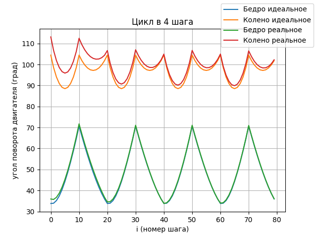

<h1 align="center">Doggo - шагающий робот-собака.</h1>

В данном репозитории собран исходный код и общие чекпоинты проектирования  Doggo. Подробный текст поставленных задач и о том, как велась магистерская диссертация, цель которой собрать работоспособный прототип шагающего робота с возможностью расширения его способностей в будущем, можно найти в основном  [тексте работы](https://github.com/POMBNK/Diploma-2.0/blob/main/Text.pdf).

Дерево директорий репозитория
```
├── images/         # Изображения для Readme.md 
└── kinematics/     # Решение обратной задачи кинематики
    └── testIK.py 
└── to_orangePi/    # Все, что находится на плате    
    ├── flask_app/      # Web интерефейс управления
    ├── main/           # Работа с модулями,двигателями,гироскопом. 
```

# Итоги сборки прототипа


# Схема подключения датчиков и двигателей


# Структурная схема управления


# Графики идеальных и реальных угловых положений двигателей с компенсацией по тангажу и крену корпуса с помощью MPU6050.



