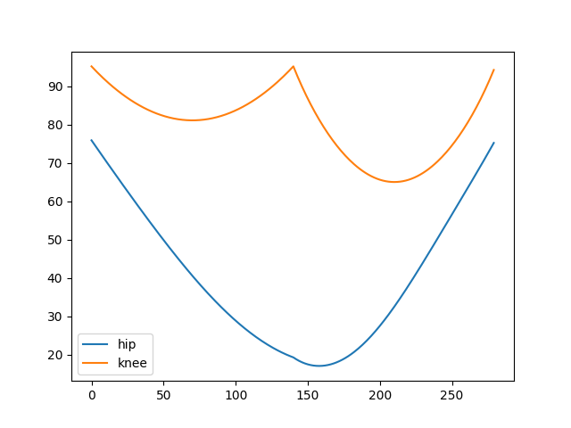

<h1 align="center">Robot IK</h1>

# True IK only
## В .txt файлах находятся угловые положения двигателей в бедре и колене робота при выполнении цикла ходьбы: step -> skip для ног 1-4 и skip -> step для ног 2-3. Номер ноги считается по часовой стрелке с передней левой.
### step - перенос корпуса.
### skip - перенос ноги обратно.

# Обратная кинематика шагающего робота
 ### Уравнения кинематики можно найти в `kinematics/testIK.py` или в `to_orangePi/main/Robot.py` 
## Анимация движения математической модели

## Угловые положения, принимаемые валом двигателя за один шаг
